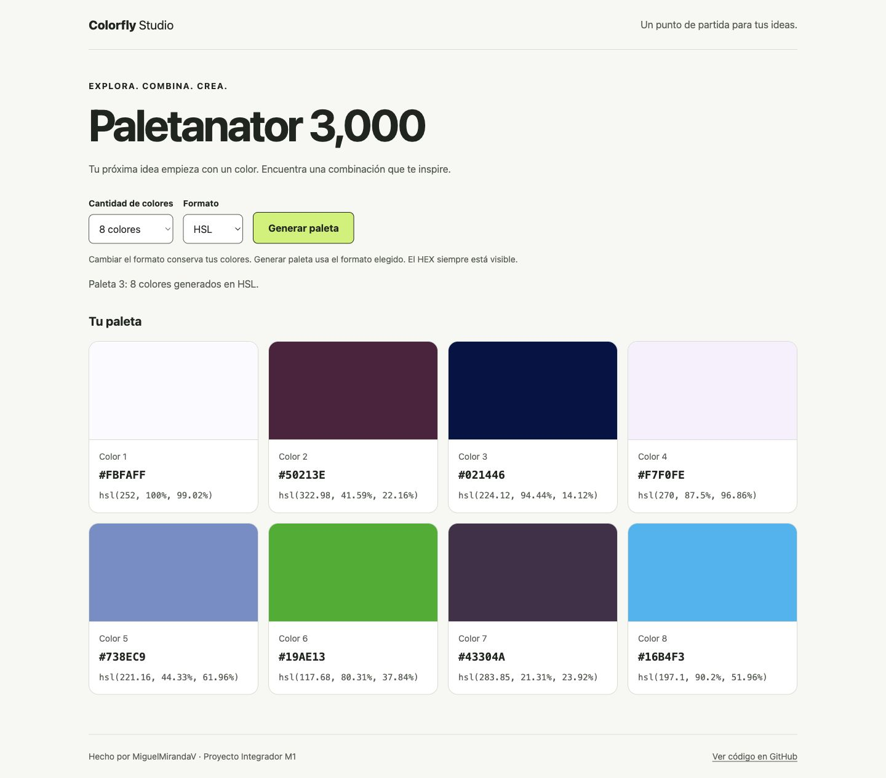

# Colorfly Studio - Paletanator 3,000

Proyecto Integrador del módulo 1 del Full Stack Bootcamp de Henry. Aplicación web estática para explorar paletas de colores aleatorias.




## Estado

MVP publicado en GitHub Pages y probado en Chrome, tanto localmente como en la URL pública.

**[Abrir la aplicación](https://miguelmirandav.github.io/ProyectoM1_MiguelMirandaV/)**

La entrega se concentra en este repositorio público, con código, documentación y evidencias.

## Funcionalidades

- Generar paletas de 6, 8 o 9 colores aleatorios.
- Generar en HEX o HSL y mantener HEX siempre visible.
- Alternar la representación sin cambiar los colores actuales.
- Mostrar mensajes de estado y reemplazar la paleta anterior sin acumular tarjetas.
- Adaptar la distribución a móvil, tablet y escritorio, con controles etiquetados y navegación por teclado.

## Tecnologías y estructura

HTML5, CSS y JavaScript sin frameworks, backend ni dependencias de aplicación. Git registra el historial y GitHub aloja el repositorio. El despliegue se hace en GitHub Pages.

```text
ProyectoM1_MiguelMirandaV/
├── index.html
├── css/
│   ├── styles.css
│   └── palette.css
├── js/
│   └── script.js
├── README.md
├── .gitignore
└── docs/
    ├── flujo-app.md
    ├── uso-ia.md
    ├── pruebas.md
    └── evidencias/
```

## Ejecución local

Requisitos para estos comandos: Git, Python 3 y un navegador moderno. Desde una terminal:

```bash
git clone https://github.com/MiguelMirandaV/ProyectoM1_MiguelMirandaV.git
cd ProyectoM1_MiguelMirandaV
python3 -m http.server 5500 --bind 127.0.0.1
```

Abre [la aplicación local](http://127.0.0.1:5500). Detén el servidor con Control+C. Si ya tienes el proyecto, abre su carpeta en VS Code y ejecuta solamente el comando del servidor en su terminal integrada. Si el puerto está ocupado por otro servidor, detenlo o usa otro puerto y ajusta la URL.

También puedes abrir `index.html` mediante la extensión Live Server de VS Code. Python o Live Server solo sirven los archivos durante el desarrollo. No se necesita `npm install` ni un proceso de compilación. Usa un servidor HTTP local: la aplicación modifica una hoja CSS del mismo origen y no se verifica su funcionamiento abriendo el archivo directamente con `file://`.

## Cómo usar la aplicación

1. Pulsa **Generar paleta** para crear los seis colores iniciales.
2. Selecciona **6, 8 o 9 colores**; el cambio genera una nueva paleta de ese tamaño.
3. Selecciona **HEX o HSL**; la vista cambia conservando los colores actuales. En HSL se muestran ambos códigos.
4. Pulsa **Generar paleta** nuevamente para crear colores en el formato seleccionado.
5. Revisa el mensaje de estado para confirmar la cantidad y el modo utilizados.

Con teclado, usa Tab para avanzar por los controles. El enlace inicial permite saltar al contenido; Enter activa el botón de generación.

## Despliegue en GitHub Pages

Sitio publicado desde `main` y `/(root)`. Configuración utilizada para reproducir el despliegue:

1. Sube los cambios a la rama `main` del repositorio público.
2. En GitHub, abre **Settings → Pages**.
3. En **Build and deployment**, selecciona **Deploy from a branch**.
4. Elige la rama `main` y la carpeta **/(root)**, y guarda.
5. Espera a que termine el despliegue; revisa su resultado en **Actions** y abre la URL que muestre Pages.
6. Comprueba que carguen CSS y JavaScript y prueba las seis combinaciones de tamaño/formato. Comprueba también que alternar formato conserve los colores.

`index.html` está en la raíz y las rutas de los recursos son relativas. La carpeta `docs` contiene documentación, no es la fuente de publicación. Los siguientes pushes a `main` actualizarán el sitio una vez configurado Pages.

Referencia: [configurar la fuente de publicación en GitHub Pages](https://docs.github.com/en/pages/getting-started-with-github-pages/configuring-a-publishing-source-for-your-github-pages-site).

## Decisiones técnicas

- **Separación de responsabilidades:** HTML describe la estructura, CSS la presentación y JavaScript genera los colores, escucha eventos y actualiza el DOM.
- **Funciones pequeñas y estado:** la generación, conversión y representación se separan; `currentPalette` conserva los colores al alternar formato. Se validan los tamaños y formatos permitidos.
- **Conversión:** HEX se usa como referencia común de la muestra. HSL se representa con dos decimales; la reconversión puede diferir hasta una unidad por canal RGB por redondeo.
- **Estilos externos:** `palette.css` recibe reglas mediante CSSOM en memoria. Al reemplazar una paleta se eliminan las reglas anteriores; el archivo de disco no cambia.
- **Accesibilidad:** estructura semántica, labels, controles nativos, foco visible, enlace de salto y mensajes de estado. Los códigos tienen una superficie blanca estable para evitar depender del contraste del color aleatorio.
- **Diseño:** variables CSS para consistencia y fuentes del sistema sin descargas externas. Grid usa una columna en móvil, dos desde 40rem y tres desde 64rem; las paletas de ocho usan cuatro desde 64rem.
- **Proceso:** MVP antes que extras, commits descriptivos, comprobación de las propuestas de IA y documentación de resultados reales.

## Uso de IA

Utilicé Codex como tutor y apoyo para planificar el proyecto, generar el código y la documentación y ejecutar comprobaciones. Mi participación incluyó definir restricciones, revisar y preguntar por las decisiones técnicas, realizar commits y pushes, incorporar capturas de conversación y configurar GitHub Pages. El registro de IA detalla las aportaciones y verificaciones.

## Documentación y evidencias

- [Flujo de la aplicación con capturas](docs/flujo-app.md).
- [Registro de pruebas y límites de la revisión](docs/pruebas.md).
- [Prompts, decisiones y uso de IA](docs/uso-ia.md).

Se probaron las seis combinaciones de cantidad/formato en cuatro anchos (320, 390, 768 y 1440 px), conversiones de colores, entradas inválidas, conservación al alternar, teclado y contraste. La revisión cubre accesibilidad básica; no equivale a una certificación ni a una prueba con lector de pantalla. En la URL pública se verificaron las seis combinaciones, conservación de HEX al alternar y ausencia de errores o advertencias en la consola capturada.

## Límites y mejoras futuras

Los colores son aleatorios: pueden repetirse y no se garantiza armonía cromática. Recargar la página reinicia la paleta. No se implementaron copiado, bloqueo, guardado local ni animaciones; se consideran mejoras opcionales después de completar la entrega.
