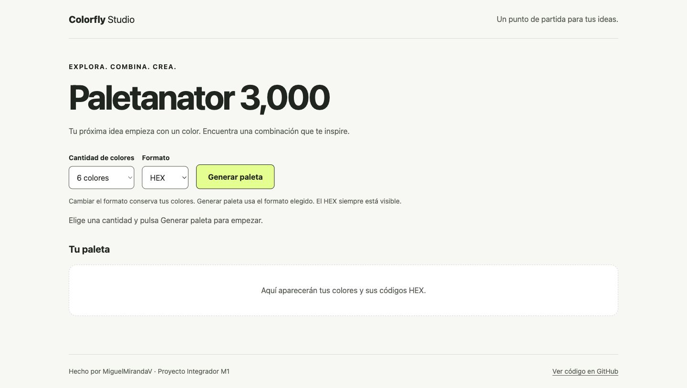
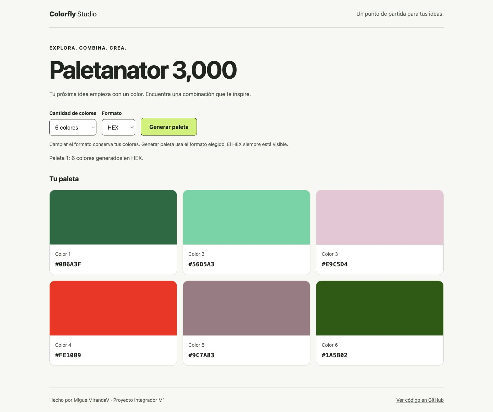
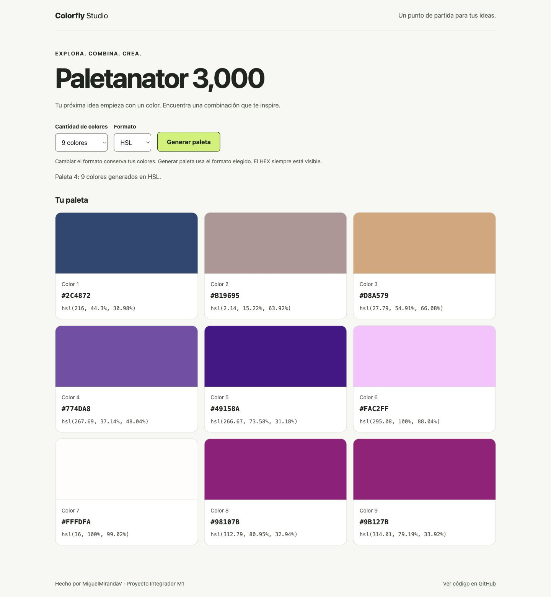
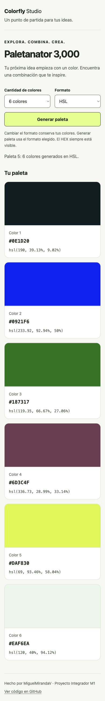

# Flujo de la aplicación

Las siguientes capturas corresponden a la aplicación local real. Los colores y el contador pueden variar entre sesiones porque la generación es aleatoria. Las capturas muestran distintos estados; no representan una única secuencia sin interrupciones.

## 1. Inicio

Al cargar la página aparecen los controles y el mensaje inicial. Todavía no hay tarjetas. JavaScript habilita los controles después de registrar los eventos.

## 2. Generar seis colores HEX

El botón lee la cantidad y el formato, valida la selección, genera los colores y actualiza la lista del DOM. Cada tarjeta contiene una muestra y su código HEX. El mensaje de estado confirma la generación.

## 3. Elegir ocho colores y mostrar HSL

Cambiar la cantidad genera otra paleta. Cambiar solamente el formato conserva los colores existentes. Al generar en HSL, se sortean los componentes HSL y se convierten a HEX. HEX permanece visible en todas las tarjetas.

## 4. Elegir nueve colores

La lista anterior se reemplaza para que el número de tarjetas coincida con el selector. En escritorio, los nueve colores se distribuyen en tres columnas.

## 5. Usar la aplicación en móvil

Los controles se adaptan al ancho y las tarjetas se muestran en una columna. Se conserva el flujo de generación y lectura de códigos.

## Relación entre eventos, funciones y DOM

- Clic en generar o cambio de cantidad → `handleGeneratePalette` → validación → `generatePalette` → guardar `currentPalette` → `renderPalette` → actualizar mensaje.
- Cambio de formato → `handleFormatChange` → representar `currentPalette` sin regenerar → actualizar mensaje.
- Renderizado → reemplazar tarjetas anteriores → crear nodos y textos → actualizar reglas de color en la hoja CSS.

Para verificarlo en DevTools, inspecciona `#palette-list`: su cantidad de elementos cambia a 6, 8 o 9. Al alternar formato, los códigos HEX deben permanecer iguales. Los resultados detallados están en [pruebas.md](pruebas.md).
